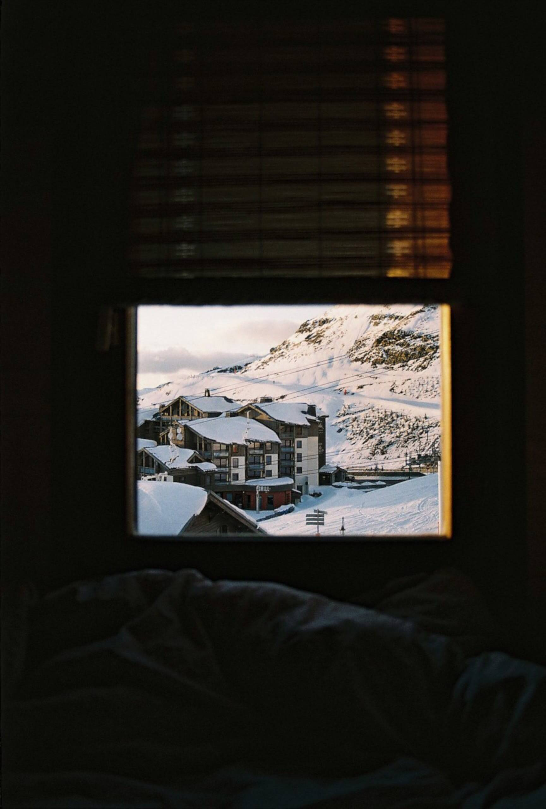
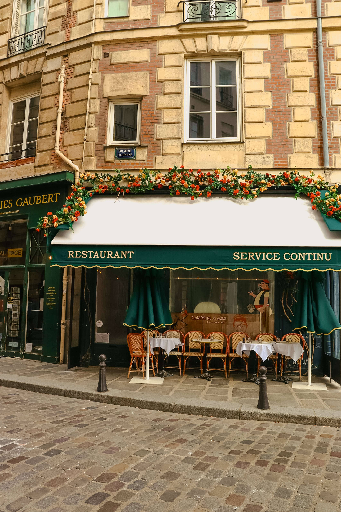
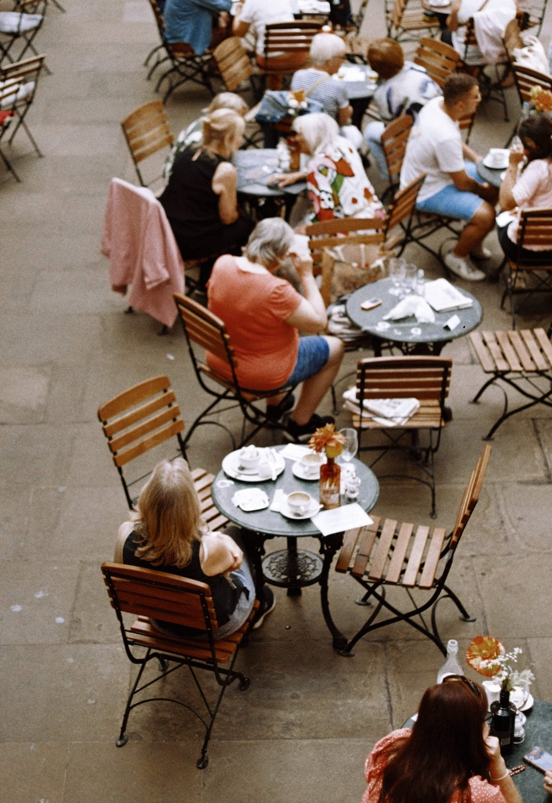
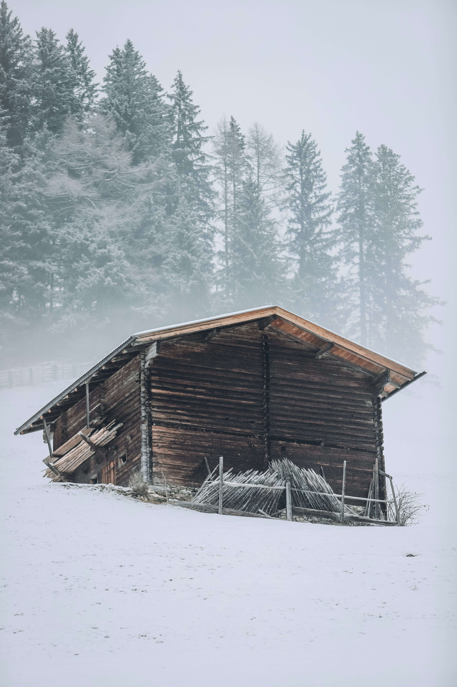

**Spots**

Description:

Spots is a web application that showcases various locations with images and descriptions. Users can view different spots, like them, and create new posts.

Technologies Used:

This project is built using:
HTML5
CSS3

User Profile:
Displays a user profile with an avatar, name, and description.
Image Gallery:
Showcases a list of spots with images and titles.
Like Button:
Allows users to like their favorite spots (future functionality).
Add New Post:
Button to add a new post (future functionality).

creenshots

Deployment
You can access the deployed project here: https://github.com/merdokiosabraham/se_project_spots

Figma

- [Link to the project on Figma](https://www.figma.com/file/BBNm2bC3lj8QQMHlnqRsga/Sprint-3-Project-%E2%80%94-Spots?type=design&node-id=2%3A60&mode=design&t=afgNFybdorZO6cQo-1)

**Images**

The way you'll do this at work is by exporting images directly from Figma — we recommend doing that to practice more. Don't forget to optimize them [here](https://tinypng.com/), so your project loads faster.

Good luck and have fun!
